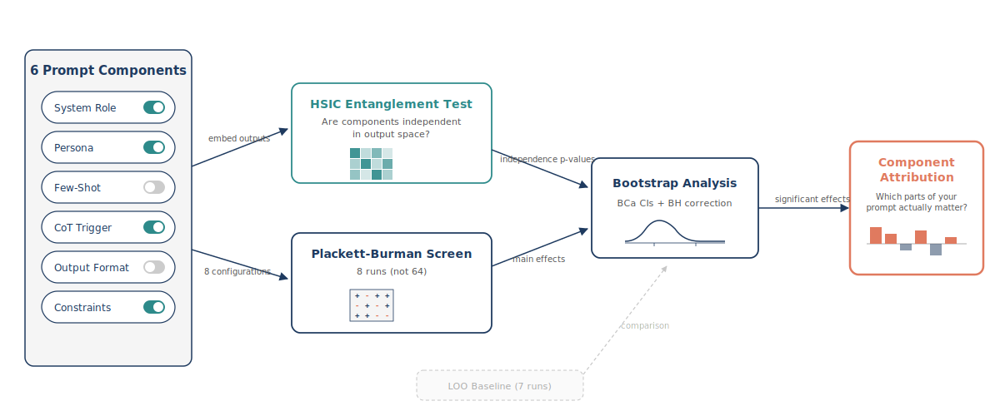
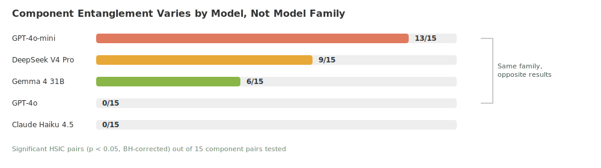

<p align="center">
  
</p>

<h1 align="center">prompt-doe</h1>

<p align="center">
  <em>Stop guessing which parts of your prompt matter. Run an experiment instead.</em>
</p>

<p align="center">
  <a href="#quick-start">Quick Start</a> &nbsp;&bull;&nbsp;
  <a href="#the-problem">The Problem</a> &nbsp;&bull;&nbsp;
  <a href="#what-we-found">What We Found</a> &nbsp;&bull;&nbsp;
  <a href="#run-it-on-your-model">Your Model</a> &nbsp;&bull;&nbsp;
  <a href="#reproducing-the-paper">Reproduce</a> &nbsp;&bull;&nbsp;
  <a href="docs/architecture.md">Architecture</a> &nbsp;&bull;&nbsp;
  <a href="#citation">Cite</a>
</p>

<p align="center">
  
  
  
  
</p>

---

## The Problem

You've built a prompt with a system role, a persona, few-shot examples, chain-of-thought, an output format, and constraints. It works — but *which pieces are actually helping?* Which ones are dead weight? Which ones are secretly fighting each other?

The standard approach — ablate one piece at a time — misses interactions and costs 64 runs for 6 components. We do it in 8.

**prompt-doe** brings [Design of Experiments](https://en.wikipedia.org/wiki/Design_of_experiments) to prompt engineering. It tells you:

1. **Which components help, which hurt, which do nothing** — with confidence intervals
2. **Whether your components interact** (entanglement) — or if they're safe to tune independently
3. **All of this at 12.5% of the brute-force cost** — 8 runs instead of 64

This is the code and data for the paper *"When Does Component Independence Hold? Output-Level Entanglement and Model-Conditional Validity of Prompt Attribution"*.

---

## What We Found

### The headline numbers

| Finding | Number |
|---------|--------|
| PB screening cost vs. full factorial | **8 runs vs. 64** (12.5%) |
| Cross-model effect direction agreement | **94.4%** (17/18 component-task pairs) |
| Entanglement range across models | **0/15 to 13/15** significant pairs |
| Length-artifact correlation | **r = −0.87** (entanglement is *not* a length effect) |

### Entanglement is model-specific — not family-specific

<p align="center">
  
</p>

GPT-4o-mini and GPT-4o are both OpenAI models. One has 13/15 entangled component pairs; the other has 0/15. Same family, opposite behavior. This means entanglement is a property of how a model was trained (likely distillation), not its architecture.

### Three things every prompt engineer should know

> **Always include output format instructions.** Most reliably beneficial component across all 5 models and all 3 tasks. No exceptions.

> **Drop the persona.** "Act as a meticulous professor" hurts accuracy in every single model-task combination we tested (15/15 negative).

> **Few-shot examples work.** Positive effect everywhere. Not surprising, but now quantified with confidence intervals.

---

## Quick Start

```bash
pip install -r requirements.txt
export OPENAI_API_KEY="your-key"

# Run everything — entanglement test, PB screen, LOO baseline, analysis
PYTHONPATH=. python scripts/run_cross_model.py gpt4o_mini
```

Results land in `results/<model-name>/` — CSVs, summary JSON, entanglement matrix.

> **First-time setup** downloads ~500MB of models (`sentence-transformers/all-mpnet-base-v2`) and caches GSM8K/BBH/MMLU-Pro datasets from HuggingFace. Allow ~5 minutes for the first run.
>
> For cross-model replication beyond OpenAI models, also set:
> ```bash
> export OPENROUTER_API_KEY="your-key"  # for Claude, DeepSeek, Gemma via OpenRouter
> ```

Want to run the phases individually?

```bash
PYTHONPATH=. python scripts/run_entanglement.py          # HSIC entanglement test
PYTHONPATH=. python scripts/run_pb_screen.py              # Plackett-Burman + LOO screening
PYTHONPATH=. python scripts/run_analysis.py               # Bootstrap CIs + BH correction
PYTHONPATH=. python scripts/run_full_factorial.py         # Full 64-run validation (optional)
```

---

## How It Works

<p align="center">
  
</p>

Every prompt is a combination of 6 binary components — each either *present* (active variant) or *absent* (neutral placeholder):

| Component | When present | When absent |
|-----------|-------------|-------------|
| **System Role** | *"You are an expert AI assistant..."* | Neutral task framing |
| **Persona** | *"Approach as a meticulous professor..."* | Generic instruction |
| **Few-Shot** | 3 worked examples | No examples |
| **CoT Trigger** | *"Think step-by-step..."* | *"Provide your answer"* |
| **Output Format** | Structured `ANSWER:` format | *"Give your answer at the end"* |
| **Constraints** | Explicit behavioral rules | *"Answer the question below"* |

The protocol has four stages:

**1. Entanglement Test** — For each pair of components, toggle one on/off, collect LLM outputs, embed them with `all-mpnet-base-v2`, and run an HSIC permutation test. If it rejects: the components *interact* in the output space — you can't tune them independently.

**2. Plackett-Burman Screening** — An 8-run [fractional factorial design](https://en.wikipedia.org/wiki/Plackett%E2%80%93Burman_design) that estimates all 6 main effects simultaneously. Each run evaluates 200 task examples. Total cost: 1,600 API calls instead of 12,800 for full factorial.

**3. LOO Baseline** — A 7-run leave-one-out ablation for comparison. Remove one component at a time from the full prompt. Standard practice — we include it to show PB recovers the same rankings cheaper.

**4. Statistical Analysis** — Bootstrap BCa confidence intervals + Benjamini-Hochberg FDR correction. Compare PB vs. LOO rankings via Spearman correlation.

### Tasks and models

Evaluated on 3 benchmarks spanning math, reasoning, and knowledge:

| Task | Source | Type | Examples |
|------|--------|------|----------|
| GSM8K | `openai/gsm8k` | Numeric | 200 |
| BBH-Date | `lukaemon/bbh` | Multiple choice | 200 |
| MMLU-Pro | `TIGER-Lab/MMLU-Pro` | Multiple choice | 200 |

Tested on 5 models across 4 providers:

| Model | Provider | Entanglement |
|-------|----------|:------------:|
| GPT-4o-mini | OpenAI | 13/15 |
| GPT-4o | OpenAI | 0/15 |
| Claude Haiku 4.5 | Anthropic | 0/15 |
| DeepSeek V4 Pro | DeepSeek | 9/15 |
| Gemma 4 31B | Google | 6/15 |

---

## Run It on Your Model

Add 6 lines to `config/models.yaml`:

```yaml
your_model:
  name: "Your Model"
  provider: "openai"        # or "openrouter" or "ollama"
  model_id: "your-model-id"
  temperature: 0.0
  max_tokens: 512
```

Then:

```bash
PYTHONPATH=. python scripts/run_cross_model.py your_model
```

This runs the full protocol — entanglement, PB, LOO, analysis — and saves everything to `results/<model-dir>/`.

**Supported providers:** OpenAI API, OpenRouter (Claude, DeepSeek, Gemma, etc.), and local Ollama models.

---

## Reproducing the Paper

Every table and figure in the paper can be regenerated from scratch. Pre-computed results are included in `results/`.

```bash
# Table 2 — Entanglement matrices
PYTHONPATH=. python scripts/run_entanglement.py

# Tables 3-4 — PB + LOO screening (GPT-4o-mini)
PYTHONPATH=. python scripts/run_pb_screen.py
PYTHONPATH=. python scripts/run_analysis.py

# Table 5 — Full factorial validation (GSM8K)
PYTHONPATH=. python scripts/run_full_factorial.py

# Table 6 — Cross-model replication
PYTHONPATH=. python scripts/run_cross_model.py claude_haiku
PYTHONPATH=. python scripts/run_cross_model.py gpt4o
PYTHONPATH=. python scripts/run_cross_model_analysis.py

# Section 4.3 — Outlier configuration investigation
PYTHONPATH=. python scripts/run_outlier_investigation.py

# Appendix B — Response-length control analysis
PYTHONPATH=. python scripts/run_response_length_analysis.py
```

---

## Repository Structure

```
prompt-doe/
├── src/
│   ├── inference.py          # LLM API wrappers (OpenAI, OpenRouter, Ollama)
│   ├── datasets.py           # Task loading, answer parsing
│   ├── prompts.py            # Prompt assembly from component flags
│   ├── components.py         # Component definitions + config loading
│   ├── independence.py       # HSIC entanglement testing
│   ├── design.py             # Plackett-Burman, LOO, full factorial matrices
│   ├── analysis.py           # Bootstrap CIs, BH correction, PB vs LOO
│   ├── validation.py         # Full factorial ground-truth comparison
│   └── transfer.py           # Cross-model transfer analysis
├── scripts/
│   ├── run_entanglement.py
│   ├── run_pb_screen.py
│   ├── run_analysis.py
│   ├── run_full_factorial.py
│   ├── run_cross_model.py
│   ├── run_cross_model_analysis.py
│   ├── run_outlier_investigation.py
│   └── run_response_length_analysis.py
├── config/
│   ├── models.yaml           # Model configurations
│   ├── tasks.yaml            # Task definitions + few-shot examples
│   └── components.yaml       # Component present/absent variants
├── results/                  # Pre-computed results for all 5 models
├── figures/                  # Publication figures (PDF + PNG + SVG)
├── paper/                    # Paper PDF
└── tests/                    # Unit tests
```

---

## Citation

```bibtex
@article{kumar2026prompt,
  title   = {When Does Component Independence Hold? Output-Level Entanglement
             and Model-Conditional Validity of Prompt Attribution},
  author  = {Kumar, Vikas},
  year    = {2026},
  url     = {https://github.com/thisisvk45/prompt-doe}
}
```

*(Will be updated with arXiv ID once posted.)*

---

<p align="center">
  <b>License:</b> MIT &nbsp;&bull;&nbsp;
  <b>Issues:</b> <a href="https://github.com/thisisvk45/prompt-doe/issues">GitHub Issues</a> &nbsp;&bull;&nbsp;
  <b>Contact:</b> <a href="https://github.com/thisisvk45">@thisisvk45</a>
</p>
